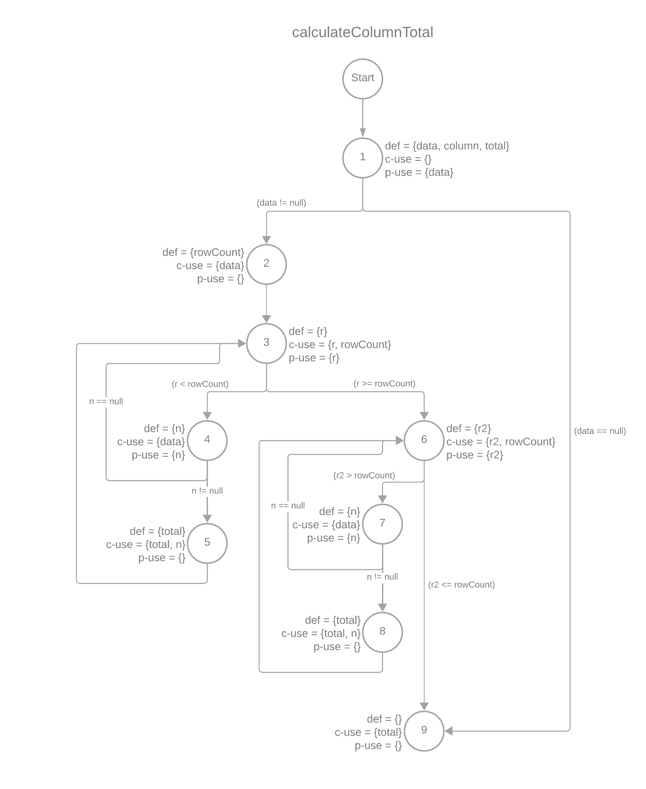
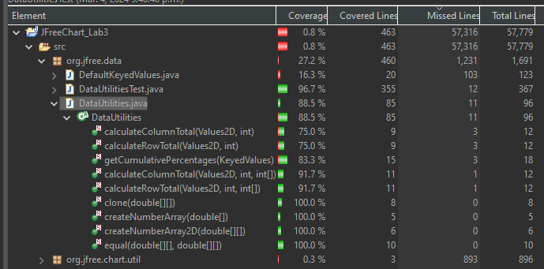
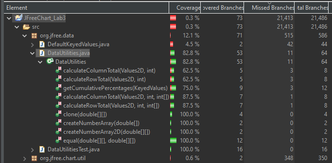
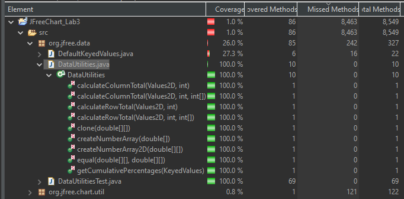

**SENG 438 - Software Testing, Reliability, and Quality**

**Lab. Report #3 – Code Coverage, Adequacy Criteria and Test Case Correlation**

| Group \#:      |     |
| -------------- | --- |
| Student Names: | Uruba Alam |
|                | Naina Gupta |
|                | Ding Kai Wu |
|                | Chuhang Qi |

(Note that some labs require individual reports while others require one report
for each group. Please see each lab document for details.)

# 1 Introduction

The goal of this assignment is to learn how to use code coverage tools and understand the different kinds of coverage. Design new test cases based on the test results to improve various coverage rates and find out potential bugs.

# 2 Manual data-flow coverage calculations for X and Y methods

## DataUtilities.calculateColumnTotal

**Data Flow Graph**

**Def-Use Sets**

| calculateColumnTotal |
| --- |
| def(1) = {data, column, total}   use(1) = {data} |
| def(2) = {total, rowCount}   use(2) = {data} |
| def(3) = {r}   use(3) = {r, rowCount} |
| def(4) = {n}   use(4) = {data, n} |
| def(5) = {}   use(5) = {total, n} |
| def(6) = {r2}   use(6) = {r2, rowCount} |
| def(7) = {n}   use(7) = {data, n} |
| def(8) = {}   use(8) = {total, n} |
| def(9) = {}   use(9) = {total} |

**DU-Pairs**

| calculateColumnTotal |
| --- |
| du(1, 1, data) = {1} |
| du(1, 2, data) = {1, 2} |
| du(1, 4, data) = {1, 2, 3, 4} |
| du(1, 7, data) = {1, 2, 3, 6, 7} |
| du(3, 3, r) = {3} |
| du(2, 3, rowCount) = {2, 3} |
| du(2, 6, rowCount) = {2, 3, 6} |
| du(4, 4, n) = {4} |
| du(4, 5, n) = {4, 5} |
| du(7, 7, n) = {7} |
| du(7, 8, n) = {7, 8} |
| du(1, 5, total) = {1, 2, 3, 4, 5} |
| du(5, 5, total) = {5} |
| du(1, 8, total) = {1, 2, 3, 4, 5, 6, 7, 8} |
| du(8, 8, total) = {8} |
| du(1, 9, total) = {1, 2, 3, 6, 9}, {1, 9} |
| du(5, 8, total) = {5, 3, 6, 7, 8} |
| du(5, 9, total) = {5, 3, 6, 9} |
| du(8, 9, total) = {8, 6, 9} |

**Parts Covered**

| Test Case | Parts Covered |
| --- | --- |
| calculateColumnTotalTest | du(1, 1, data), du(1, 2, data), du(1, 4, data), du(3, 3, r), du(2, 3, rowCount), du(2, 6, rowCount), du(4, 4, n), du(4, 5, n), du(1, 5, total), du(5, 5, total), du(1, 9, total), du(5, 9, total) |
| calculateColumnTotalNegativeTest | du(1, 1, data), du(1, 2, data), du(1, 4, data), du(3, 3, r), du(2, 3, rowCount), du(2, 6, rowCount), du(4, 4, n), du(4, 5, n), du(1, 5, total), du(5, 5, total), du(1, 9, total), du(5, 9, total) |
| calculateColumnTotalZeroTest | du(1, 1, data), du(1, 2, data), du(1, 4, data), du(3, 3, r), du(2, 3, rowCount), du(2, 6, rowCount), du(4, 4, n), du(4, 5, n), du(1, 5, total), du(5, 5, total), du(1, 9, total), du(5, 9, total) |
| calculateColumnTotalNullTest | du(1, 9, total) |
| calculateColumnTotalExceptionTest | du(1, 9, total) |
| calculateColumnTotalMinMaxTest | du(1, 1, data), du(1, 2, data), du(1, 4, data), du(3, 3, r), du(2, 3, rowCount), du(2, 6, rowCount), du(4, 4, n), du(4, 5, n), du(1, 5, total), du(5, 5, total), du(1, 9, total), du(5, 9, total) |
| calculateColumnTotalColumnOneTest | du(1, 1, data), du(1, 2, data), du(1, 4, data), du(3, 3, r), du(2, 3, rowCount), du(2, 6, rowCount), du(4, 4, n), du(4, 5, n), du(1, 5, total), du(5, 5, total), du(1, 9, total), du(5, 9, total) |

**DU-Pair Coverage**

*excluding unreachable paths*

TR for data = 3 paths  
Test paths = 3 paths  

TR for r = 1 path  
Test paths = 1 path  

TR for rowCount = 2 paths  
Test paths = 2 paths  

TR for n = 2 paths  
Test paths = 2 paths  

TR for n = 0 paths (the other n)  
Test paths = 0 paths  

TR for total = 5 paths  
Test paths = 5 paths  

Overall Coverage = 100%

## Range.constrain(double val)

**Data Flow Graph**

**Def-Use Sets**

| constrain(double val) |
| --- |
| def(1) = {result}   use(1) = {value} |
| def(2) = {}   use(2) = {value} |
| def(3) = {}   use(3) = {this.upper} |
| def(4) = {result}   use(4) = {this.upper} |
| def(5) = {}   use(5) = {value, this.lower} |
| def(6) = {result}   use(6) = {this.lower} |
| def(7) = {}   use(7) = {result} |

**DU-Pairs**

| constrain(double val) |
| --- |
|du(1, 1, value) = {1}|
|du(1, 3, value) = {1, 2}|
|du(1, 5, value) = {1, 2}|
|du(1, 7, value) = {1, 2, 3, 5, 6, 7}|
|du(3, 3, this.upper) = {3}|
|du(5, 5, this.lower) = {5}|
|du(5, 6, this.lower) = {5, 6}|
|du(1, 4, result) = {1}|
|du(4, 4, result) = {4}|
|du(1, 7, result) = {1, 4, 6, 7}|
|du(5, 6, result) = {5, 6}|
|du(6, 6, result) = {6}|
|du(7, 7, result) = {7}|

**Pairs Covered**
| Test Case | Pairs Covered |
| --- | --- |
| constrainShouldBePositiveValue | du(1, 1, value), du(1, 3, value), du(1, 7, value), du(1, 4, result), du(4, 4, result), du(1, 7, result) |
| constrainShouldBeNegativeValue | du(1, 1, value), du(1, 5, value), du(1, 7, value), du(5, 5, this.lower), du(5, 6, this.lower), du(5, 6, result) |
| constrainShouldBeZero | du(1, 1, value), du(1, 2, value), du(1, 7, value), du(1, 7, result) |
| constrainShouldBeUpperBoundaryValue | du(1, 1, value), du(1, 3, value), du(1, 7, value), du(1, 4, result), du(4, 4, result), du(1, 7, result) |
| constrainShouldBeLowerBoundaryValue | du(1, 1, value), du(1, 5, value), du(1, 7, value), du(5, 5, this.lower), du(5, 6, this.lower), du(5, 6, result) |
| constrainMaxTest | du(1, 1, value), du(1, 3, value), du(1, 7, value), du(1, 4, result), du(4, 4, result), du(1, 7, result) |
| constrainMinTest | du(1, 1, value), du(1, 2, value), du(1, 7, value), du(1, 7, result) |

# 3 A detailed description of the testing strategy for the new unit test

A: double calculateColumnTotal(Values2D data, int column)  
A1. Data contains positive value, valid  
A2. Data contains negative value, valid  
A3. Data contains only zero value, valid  
A4. Data contains only null value, invalid  
A5. Data contains invalid data object(non-double), invalid  
A6. Data contains MIN_VALUE and Max_VALUE, valid  
A7. Data contains positive value and two columns, but just the column_1 will be used, valid  

B: double calculateRowTotal(Values2D data, int row)  
B1. Data contains positive value, valid  
B2. Data contains negative value, valid  
B3. Data contains only zero value, valid  
B4. Data contains only null value, invalid  
B5. Data contains invalid data object, invalid  
B6. Data contains MIN_VALUE and Max_VALUE, valid  
B7. Only the values in the row_1 will be used  

C: java.lang.Number[] createNumberArray(double[] data)  
C1. Data contains normal value, valid (contains positive, negative, and zero values)  
C2. Data is empty, valid  
C3. Data contains null value, invalid  
C4. Data contains MIN_VALUE and Max_VALUE, valid  

D: java.lang.Number[] createNumberArray2D(double[][] data)  
D1. Data contains normal value, valid (contains positive, negative, and zero values)  
D2. Data is empty, valid  
D3. Data contains null value, invalid  
D4. Data contains MIN_VALUE and Max_VALUE, valid  

E: KeyedValues getCumulativePercentages(KeyedValues data)  
Negative values in cumulative percentages makes no sense as we cannot have negative percentages.  
E1. Data contains positive value, valid  
E2. Data is empty, valid  
E3. Data contains zero value, valid  
E4. Data contains null value, invalid  
E5. Data contains invalid data object, invalid  
E6. Data contains MIN_VALUE and Max_VALUE, valid  

F: boolean equal(double[][] a, double[][] b)  
F1. Two arrays contain normal and same value, return true (contains positive, negative, and zero values)  
F2. One array and the other array has different length, return false  
F3. Two arrays contain normal but have different values, return false  
F4. Two arrays are null, invalid  
F5. The first array is null but the second array has normal values, invalid  
F6. The second array is null but the first array has normal values, invalid  

G: double[][] clone(double[][] source)  
G1. Use this function to create a same array as the input array. Firstly, compare the lengths of two arrays. If the length-compare passed, then compare every element in the two arrays.  

**Class Range Test Plan**

Testing **Range()**

| Testing Function | Equivalent Classes | Expected Outcomes | 
| --- | --- | --- |
| testCtorValues | Between invalid range values. Range: 50 to 4 | returns: Will throw an IllegalArgumentException |

Testing **toString()**

| Testing Function | Equivalent Classes | Expected Outcomes | 
| --- | --- | --- |
| testToString | Between valid range values. Range: -1 to 1 | returns: A printed string to terminal  |

Testing **getLength()**

| Testing Function | Equivalent Classes | Expected Outcomes | 
| --- | --- | --- |
| getNegToPosLength | Input between valid range values. Range: -1 to 1 | returns: 2 |
| getLengthPostoPos | Input between valid range values. Range: 1 to 10 | returns: 9 |

Testing **intersects( Range range1, Range range2)**

| Testing Function | Equivalent Classes | Expected Outcomes | 
| --- | --- | --- |
| intersectsOverlapWithin | Between valid range values. Range: 0 to 10 and 1 to 10  | returuns: true |
| intersectsOverlapWithBiggerRange | Between valid range values. Range: -1 to 1 and -10 to 0  | returuns: true |

Testing **intersects(double b0, double b1)**

| Testing Function | Equivalent Classes | Expected Outcomes | 
| --- | --- | --- |
| intersectsBiggerTestRangesOverlaps | Between valid range values. Range: -1 to 1 and -5 to 5  | returuns: true |
| intersectsLessThanLB | Between valid range values. Range: 0 to 10 and -2 to 5 | returuns: true |
| intersectsLessThanLB2 | Between valid range values. Range: 0 to 10 and -2 to 11 | returuns: true |
| intersectHalfOverlap | Between valid range values. Range: -1 to 1 and 0 to 5  | returns: true |
| intersectsWithinRange | Between valid range values. Range: 0 to 10 and 2 to 5  | returns: true |

Testing **contains(double b0)**

| Testing Function | Equivalent Classes | Expected Outcomes | 
| --- | --- | --- |
| containsLowerEdgeValue | Between valid range values. Range: -1 and 1, contains -1 | returuns: true |
| containsUpperEdgeValue | Between valid range values. Range: -1 and 1, contains 1 | returuns: true |
| containsBothUBandLB | Between valid range values. Range: 1 and 1, ccontains 1 | returuns: true |

# 4 A high level description of five selected test cases you have designed using coverage information, and how they have increased code coverage

You can find all the test case references in question 3

1:
Test case - C1 - java.lang.Number[] createNumberArray(double[] data)  
Input: double[] data = { 1.0, 2.5, -3.5, 4.5, 0.0 }  
The input array is neither null nor empty, which allows all the codes to be exercised and guarantee 100% statement coverage.

2:
Test case - F1 - boolean equal(double[][] a, double[][] b)  
Inputs:  
double[][] a = { { 1.0, -2.5, 3.5, 0 }, { -5.0, 6.5, 7.5, 8.5 } }  
double[][] b = { { 1.0, -2.5, 3.5, 0 }, { -5.0, 6.5, 7.5, 8.5 } }  
Two 2D-arrays are not null and have the same contents and length, which allows all the if-statements to be passed and continue to execute the for-loop. Exercising the for-loop covers all the codes and guarantee 100% statement coverage.

3:
Test case - F4 - boolean equal(double[][] a, double[][] b)  
Inputs:  
double[][] a = null  
double[][] b = null  
The first array is null so that the if-statement (b == null) can be exercised. This test case can increase the condition coverage.

4:
Test case - void testCtorValues()  
Inputs: Range(50,4)  
Creating a Range object with mixed up values for the constructor. Instead of low to high the range is created with high to low values. This tested the constructor of the Range class to see if the if-statement inside the constructor works and throws a new illegal argument exception. This increased the branch coverage to 100%, line coverage to 100%, and method coverage to 100%.

5:
Test case - void constiansBothUBandLB ()  
Inputs: exRange7.contains(1)  
This fucnction ensures that we tested the else statement in the contains function. This makes sure that if both upper and lower bound were the same, that value would be contained within the range. It made sure to go into the else statement. This increased the branch coverage to 75%, line coverage to 100%, and method coverage to 100%. Note: The last else statement was impossible to get 100% branch coverage due to the 2 if-statemnts before it.

# 5 A detailed report of the coverage achieved of each class and method (a screen shot from the code cover results in green and red color would suffice)

**DataUtilities Line Coverage**

**DataUtilities Branch Coverage**

**DataUtilities Method Coverage**

**Range Method Coverage**

**Range Line Coverage**

**Range Branch Coverage**

# 6 Pros and Cons of coverage tools used and Metrics you report 

One of the coverage tools used was EclEmma. Pros of this tool are that it clearly shows the statements of the class that need to be tested like methods, branches, and statements. All the information is colour coated, and well organized. A con with the EclEmma tool is that you must navigate to the file system to the specific class every time you want to run the coverage tool. This is time consuming and could be visually improved. JaCoCo is another coverage tool we used. A pro of this tool is that it can download a report in the form of an HTML file. A con, is in order to find the details of each method, the whole report needs to be downloaded, otherwise only general coverage can be accessed. 

# 7 A comparison on the advantages and disadvantages of requirements-based test generation and coverage-based test generation.

Requirements-based test
Advantage: Requirements-driven test generation guarantees that tests encompass all the designated software requirements, thereby guaranteeing that the system's functionality meet the anticipated standards.
Disadvantage: Requirements-driven test generation might neglect situations not explicitly outlined in the requirements document, consequently resulting in an incomplete coverage of all potential issues.

Coverage-based test
Advantage: Coverage-based test generation can ensure that test cases cover all execution paths of the code, help evaluate the comprehensiveness of the test, and discover potential code defects.
Disadvantage: Coverage-based test generation may ignore some important functional requirements, resulting in the inability to fully test the functionality of the system. Sometimes in order to achieve high coverage, substantial test cases may be generated which increases the cost and complexity of testing.

# 8 A discussion on how the team work/effort was divided and managed
Uruba and Naina worked on the coverage tests, the data flow graph, the def-use sets per statement, DU-pairs per variable, and calculate the DU-Pair coverage for Range Tests. Chuhang and Bill worked on on the coverage tests, the data flow graph, the def-use sets per statement, DU-pairs per variable, and calculate the DU-Pair coverage for Data Utilities. This way two pairs were able to focus on exploring one class thoroughly. We communicated clearly and looked over one another's code to catch each other's mistakes and divided all work evenly. 

# 9 Any difficulties encountered, challenges overcome, and lessons learned from performing the lab

Difficulties: Understanding the different types of coverage can be difficult. It is hard to distinguishing between branch coverage and condition coverage. Sometimes it is necessary to create a large number of test cases to improve overall coverage. However, in many scenarios it is difficult to design corresponding test cases.
What we learned: We use test coverage tools to test coverage to know which parts of code need to design additional test cases to be exercised.

# 10 Comments/feedback on the lab itself

Through the lab, we learned a different technique to white box coverage testing. It allowed us to thoroughly explore how to get more coverage on our tests we previously created. It was time consuming, but the outcome was a great learning experience. 
