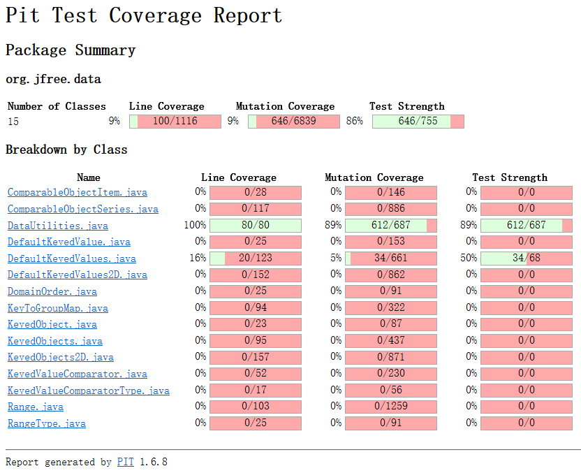
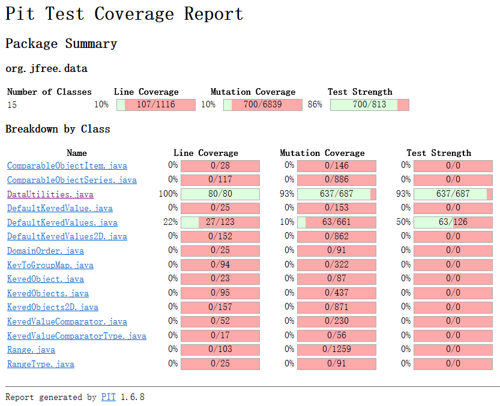

**SENG 438 - Software Testing, Reliability, and Quality**

**Lab. Report \#4 – Mutation Testing and Web app testing**

| Group \#:   |  4 |
| -------------- | --- |
| Student Names: | Uruba Alam |
|                | Naina Gupta |
|                | Ding Kai Wu |
|                | Chuhang Qi |

# 1. Introduction
In this lab, we explored mutation testing on two classes: Range.java and DataUtilities.java. We used the PIT testing tool to see the mutation coverage on eclipse. Through the PIT test results provided, we designed new test cases to increase mutation coverage. In the second part of this lab, we explored GUI test automation, record and replay with the Selenium IDE extension for web interface testing. 

# 2. Analysis of 10 Mutants of the Range class 

***Analysis of 10 mutants produced by pitest for Range.java class:***
  
 
**1. Negated conditional → KILLED (Line 90, Mutant 2)**

For the Range constructor this means the condition: if (lower > upper) condition was negated into if (lower <= upper). The test case for checking the upper and lower values when a new object is constructed is testCtorValues() where it uses 50 for the lower value and 4 for the upper value. This test will not call the IllegalArgumentException class since the condition is negated and thus the change in the behaviour of the class will be detected and the mutant is killed.  

  

**2. Negated conditional → SURVIVED (Line 157, Mutant 2)**

This is another negation condition mutation for the intersects method. The test cases failed to recognize the mutant because of the if condition failing and then going into the else statement which then returns true. We can see this in the intersectsBiggerTestRangesOverlaps() test case where the return statement in the else branch:  

return (b0 < this.upper && b1 >= b0); 

will return true, so the mutant, which will cause the if condition on Line 157 to be false thus going into the else statement will still be true. We need to fix this by adding more branches aside the if and else that is already there and catch more instances of intersection instead of a certain 1 test.  

  

**3. Less than to greater or equal → KILLED (Line 161, Mutant 33)**

This mutant changes the condition in Line 161 in the intersects method: 

 return (b0 < this.upper && b1 >= b0); 

The less than (<) operator is changed into a greater than or equal (>=) to operator. This mutation was detected by the the intersectHalfOverlap() and intersectWithinRange() test cases since they both go into Line 161. Changing the less than sign would mean that the else statement (Line 161) is automatically false due to the logical AND operator and thus will return false when the return value should be true, thus the assertTrue() method catches the mutation and kills the mutation.  

 

 

**4. removed conditional - replaced equality check with true → SURVIVED (Line 189, Mutant 4)**

This mutation changes the constrain function, specifically the If condition on Line 189:  

if (!contains(value))  

The condition is replaced with a constant true value and therefore should be caught. The test cases that shouldn’t work are: constrainShouldBePositiveValue(), constrainShouldBeNegativeValue() and constrainShouldBeZero(). However since the condition is true, the code goes through the first If statement and then skips over the inner if and else if statements (since they are false) and returns the result value which would have been the same return value with or without thus the mutant ends up surviving since none of the test cases will fail due to the structure of the code.  

  

**5. Negated double field upper → KILLED  (Line 191, Mutant 1)**

This mutant changes the constrains function Line 191:	 

result = this.upper; 

By negating the this.upper into -this.upper. The mutant was caught by the constrainShouldBeUpperBoundaryValue() test case which takes in a value of a 100 and goes into the first if branch and then the second if branch. Since the mutation negates the result, it catches the error with the assertEquals() method since the expected result was 10 and the mutated result is -10.  

  

**6. Negated double field lower → SURVIVED (Line 194, Mutant 1)**

This mutant changes the constrains function Line 194:	 

result = this.lower; 

By negating the this.lower into -this.lower. The mutant is not caught by the constrainShouldBeLowerBoundaryValue() test case which takes in a value of a -50 and goes into the first if branch and then the nested else if branch. In the constrainShouldBeLowerBoundaryValue() method, we used exRange2 which is a test range we created from 0 to 10. Since the mutation negates the result = this.lower Line, it does not catch the error because the lower boundary in exRange2 is 0 and negating 0, still results in 0. Therefore, the assertEquals() method does not catch the error, and the test passes, even though it should not. To fix this issue, we created another test case where the range’s lower boundary is not 0. 

 

**7. Incremented (++a) double local variable number 3 → KILLED (Line 197, Mutant 6)**

This mutant changes the constrains function Line 197:	 

return result; 

By incrementing the result variable into ++result. The mutant pre-increments the result variable. This means that in the constrain function of the Range class, the result variable is incremented before it gets returned. This causes the test cases for constrain in RangeTest.java to fail because the assertEquals() function catches the error and is able to see that the value has been changed. For that reason, the failure is detected, and the mutant is killed.  

 
 

 
**8. Incremented (a++) double local variable number 3 → SURVIVED (Line 197, Mutant 4)**

This mutant changes the constrains function Line 197:	 

return result; 

By incrementing the result variable into result++. The mutant post-increments the result variable. This means that in the constrain function of the Range class, the result variable is incremented after it gets returned. This allows the test cases for constrain in RangeTest.java to pass because the increment happens after the return, so the tests are not able to catch that the return value has been altered. The assertEquals() function does not catch the error and is not able to see that the value has been changed. For that reason, the test passes, and the mutant survives.  

  

 

**9. negated conditional → KILLED (Line 217, Mutant 1)**

This mutant changes the combine function on Line 217: 

if (range1 == null) { 

By negating the if condition to if (range1 != null). The mutant negates the if statement. This means that in the combine function of the Range class, if range1 is actually null, it will not go into the first if  statement after the mutation and that would cause the function to return the wrong range. The combinecombineIgnoringNaNFirstNullTest() test ensures this test fails because it ensures that if the first range (range1) is null, the second range (range2) should be retuned. The assertEquals() catches the failure. Thus, the mutant gets killed. 

 
 

**10. equal to less or equal → SURVIVED(Line 281, Mutant 7)**

This mutant changes the static max function on Line 281: 

if (Double.isNaN(d1)) { 

By making the if condition to if (Double.isNaN(d1) <= 0.0). The mutant changes the if statement. Instead of checking if d1 is a NaN value, it now checks whether the result of ‘Double.isNaN(d1)’ is less than or equal to 0. This does not make sense because ‘Double.isNaN(d1)’ always retuns a boolean value so comparing it to 0.0 does not make sense. However, this test is able to survive because our Range.java file does not have any test cases for the max function. Thus, the mutant survives. 

  

# 3. Report all the statistics and the mutation score for each test class

## Range Mutation Score Results (Original)

## PIT Test Mutation Coverage for Range (Updated)
 
 
## PIT Test Mutation Coverage for DataUtilities (Original)

## PIT Test Mutation Coverage for DataUtilities (Updated)

# 4. Analysis drawn on the effectiveness of each of the test classes

*The Mutant #s and Line #s below are based on the PIT Mutation Summary report. The report can't be included in this report. Please run the mutation test once to generate the reports.*

**Below are the new test cases which were added to RangeTest.java the test suite in order to kill surviving mutants:**

**TESTS**: testErrorMsg()  
**KILLED**: Mutant 3, 4, 5, 8 and 9 on Line 91  
&emsp;&emsp;&emsp;&ensp;&nbsp;Mutant 4, 5, 6, 7, 10 and 11 on Line 92

 
**TESTS**: intersectsFromLowerBoundary()  
&emsp;&emsp;&emsp;&nbsp;intersectsAtUpperBoundary()  
**KILLED**: Mutants 25 and 12 on Line 158  
&emsp;&emsp;&emsp;&ensp;&nbsp;Mutants 3, 32 and 34 on Line 161

 
**TESTS**: decimalPositiveIntersection()  
&emsp;&emsp;&emsp;&nbsp;decimalNotIntersected()  
**KILLED**: Mutants 18 on Line 157  
&emsp;&emsp;&emsp;&ensp;&nbsp;Mutants 47 and 50 on Line 161

**TESTS**: doesNotIntersectBelowLB()  
&emsp;&emsp;&emsp;&nbsp;doesNotIntersectAboveUB()  
**KILLED**: Mutants 2, 3, 4, 5, 7, 8, 10, and 11 on Line 157  
&emsp;&emsp;&emsp;&ensp;&nbsp;Mutants 2, 5, 8, 10, 13, 16, 19 and 21 Line 158  
&emsp;&emsp;&emsp;&ensp;&nbsp;Mutants 2, 6, 11, 14, 15, 19, 22, 25, and 27 on Line 161  

**TESTS**: constrainShouldBeLowerBoundaryValue()  
**KILLED**: Mutant 1 on Line 194
 
**TESTS**: combineTwoDifferentRanges()  
**KILLED**: Mutant 3 on Line 220

**TESTS**: scaleTestLessThanZeroFactor()  
&emsp;&emsp;&emsp;&nbsp;scaleTestZeroFactor()  
&emsp;&emsp;&emsp;&nbsp;scaleTestWithPosFractionScale()  
&emsp;&emsp;&emsp;&nbsp;scaleTestWithPositiveScale()  
**KILLED**: Mutant 1, 2, 7, 9, 13 and 15 on Line 410

At the end, we managed to kill 945 mutants and 314 survived. We were only able to increase mutation coverage by 5% (70% to 75%) because we did not understand what some of the mutations actually did to the original code. For example Mutant 21 `Substituted 1 with -1 → SURVIVED` for line 161 which was `return (b0 < this.upper && b1 >= b0);`. It did not make sense, hence we were not able to kill those types of mutations. We also noticed some of the mutants we initially killed with some tests, re-survived after adding more tests, so it did not allow our coverage to increase. The last reason for not being able to increase the coverage all the way up to 10% is because it took very long (30 minutes) to load the PIT summary every time so, we would have to write multiple tests trying to kill different mutants before loading the summary, and due to that, we could not track exactly why certain mutants re-survived after they were initially killed.

**Below are the new test cases which were added to DataUtilitiesTest.java the test suite in order to kill surviving mutants:**

**TESTS**: equalLoopMutationTest()  
**KILLED**: Mutant 13 on Line 85  

**TESTS**: cloneDifferentLengthTest()  
**KILLED**: Mutant 1 on Line 106  
&emsp;&emsp;&emsp;&ensp;&nbsp;Mutants 4 and 5 on Line 107  
&emsp;&emsp;&emsp;&ensp;&nbsp;Mutants 1 and 2 on Line 108  

**TESTS**: calculateColumnTotalInvalidRowTest()  
**KILLED**: Mutant 17 on Line 127  
&emsp;&emsp;&emsp;&ensp;&nbsp;Mutants 3 on Line 154  
&emsp;&emsp;&emsp;&ensp;&nbsp;Mutants 1 and 2 on Line 108  

**TESTS**: calculateColumnTotalEmptyRowsTest()  
**KILLED**: Mutant 3 and 5 on Line 158  
&emsp;&emsp;&emsp;&ensp;&nbsp;Mutants 3 on Line 154  

**TESTS**: calculateRowTotalInvalidColTest()  
**KILLED**: Mutant 17 on Line 178  
&emsp;&emsp;&emsp;&ensp;&nbsp;Mutants 2 on Line 179  

**TESTS**: calculateRowTotalEmptyColTest()  
**KILLED**: Mutant 3 and 5 on Line 209  

**TESTS**: createNumberArray2DNaNTest()  
**KILLED**: Mutant 3 Line 244  

**TESTS**: getCumulativePercentagesInvalidItemTest()  
**KILLED**: Mutant 16 Line 265  
&emsp;&emsp;&emsp;&ensp;&nbsp;Mutants 16 on Line 272  

**TESTS**: calculateColumnTotalNullDataTest()  
**KILLED**: Mutant 1 Line 124  

**TESTS**: calculateColumnTotalNullParamTest()  
**KILLED**: Mutant 1 Line 150  

**TESTS**: calculateRowTotalNullParamTest()  
**KILLED**: Mutant 1 Line 175  

**TESTS**: calculateRowTotalNullDataTest()  
**KILLED**: Mutant 1 Line 201  

**TESTS**: getCumulativePercentagesEmptyDataTest()  
**KILLED**: Mutant 1 Line 262  

In the end, we have 50 survived mutations and killed 629 mutations. We increased our mutation coverage from 89% to 93%. It becomes extremely hard to increase the coverage more. This is mainly caused by how the code was mutated. Some are impossible to kill, i.e. `Less than to not equal` for the line `for (int v = 0; v < validCols.length; v++)`. Since they are equivalent mutations it's impossible to kill. Some descriptions of mutations are also hard to understand and we are not able to figure out what they mean.

# 5. A discussion on the effect of equivalent mutants on mutation score accuracy
Some equivalent mutants were the Incremented and Decremented mutants (post and pre) where a lot of the surviving code was because we didn't test the values after they returned a value. These equivalent mutants can be fixed using decimal values or using the class fields after they have been used once. 

Another type of equivalent mutants is the negated conditional mutations where the condition statement (for an if, while or for loop) is negated and therefore the mutants that survived after the negation are easy to fix, since all we had to do was make tests for testing those specific conditions as well as testing the false input values and compare it with the right values. 

Another common mutant was one that replaced the conditional statements with constant true or false, this was an easy fix and decreased our mutation score accuracy due to there being a lack of variety in the test cases with different equivalence inputs. The constant true or false can be easily killed with assertTrue or assertFalse lines in the new test cases. 

The mutations with the message "replaced boolean return with true" means that we had no false tests for that method when we were testing. When testing this was an easy equivalent mutant to fix since it just meant we had to test for the false of the condition that did not kill a constant true or false mutant. 

For post increment or decrement mutants we found that using the method and then checking the values of the class fields to see if they are the same would kill the mutants. 

# 6. A discussion of what could have been done to improve the mutation score of the test suites

We will use DataUtilitiesTest for example. It is extremely difficult to increase the test score by 10%, as our original code already have a coverage of 89%. We managed to get the coverage to 93% after adding some new test cases. A lot of new test cases involves the testing on a null object, which was not covered by previous black-box testing and white-box testing. The generated report helped us a lot by telling us what mutation was killed and what survived. We then targeted all the survived mutations and try to kill them. However, not all mutations are easily targetable and some mutations generated by the report is too ambiguous to understand what it means.

# 7. Why do we need mutation testing? Advantages and disadvantages of mutation testing

In white-box testing we focused on test coverage. This ensured the degree to which the source code of a program is exercised. But it does not guarantee the program is bug free. For example, `ParamChecks.nullNotPermitted(data, "data");` is checked every time we pass any object to the method. The coverage test will tell us this has been checked, but we forgot to pass a null object to this statement to check if an exception has been thrown.  
One advantage of mutation testing is that it allows us to catch missed testing cases like the example above. It manually injects bugs into the system and our test cases are supposed to catch the mutations. Both RangeTest and DataUtilitiesTest already have 100% coverage on all the reachable codes, but mutation tests still pointed out many missing test cases.  
Mutation testing also have some disadvantages. One disadvantage is the "waste" of resources. During our mutation testing the operation that takes up most of the time is running the test itself. It takes anywhere from 3 and half minutes to 11 minutes to run a single mutation test, based on how fast the CPU is. Mutation testing is too resource intensive and could lead to a lot of time wasted. Another disadvantage is the report generated by Selenium is very hard to understand or impossible to kill for some mutation test cases. For example, for the line `return (b == null);` we have the mutation `Substituted 1 with -1 → SURVIVED`. We have no idea that the operand means and cannot find a suitable test case to cover this issue. 

# 8. Explain your SELENUIM test case design process

We designed the Selenium test cases following a similar process as in assignment 1. We will be using exploratory testing to test https://www.ebay.ca/ for 8 functionalities. Since ebay is a popular e-commerce website, our test cases will be designed around how a customer may interact with ebay when they want to purchase an item. The test cases include searching for an item, add item to cart, sign in to user account, etc. We tried to design each function with a valid and invalid input, but it's not always possible. For example, to test the filter function there is not invalid inputs on ebay. This is because all the filter labels are already generated by the website.

# 9. Explain the use of assertions and checkpoints

**Please be aware that some test cases require specific pre-conditions to be met. Test will fail otherwise.  
To change account address the user needs to be logged in.  
In order for the Log In Valid test case to pass, the user account name must match the account name specified in the assertion.**

After each test, there is an assert text command. This command _Confirm that the text of an element contains the provided value. The test will stop if the assert fails._ Each assert text command has a target and a value. By specifying what to look for after each test, we are able to determine if the test passed or failed. All other commands have built in pass/fail checks and is handled by Selenium so we don't need to create extra assertions and checkpoints.

# 10. How did you test each functionality with different test data

The value field allows us to test each functionality with different test data. As mentioned above, it is not always possible to test for invalid inputs. Some tests also requires us to click on a different location on the website instead of different inputs. However, we are able to use this function for some of the tests. For example, in Change Account Address Valid test, we input a valid address under the value field. In Change Account Address Invalid test, the only change was to input an invalid address using the same field.

# 11. Discuss advantages and disadvantages of Selenium vs. Sikulix

Selenium and SikuliX are both automation tools, but they target different applications:

Selenium excels in automating web applications. It interacts with web elements like buttons, text fields, and menus by identifying them using HTML attributes such as ID, name, and XPath.

SikuliX, on the other hand, uses image recognition to automate anything on the screen, including desktop applications and even web elements. You provide an image of the element you want to interact with, and SikuliX finds it and performs actions like clicks or typing.

Here are advantages and disadvantages of each IDE:

**Selenium**
 
Advantages:
 
*Widely used: Large community and extensive documentation available.
 
*Cross-browser compatibility: Works with various web browsers.
 
*Language support: Supports multiple programming languages.

Disadvantages:
 
*Limited to web: Can't automate desktop applications.
 
*Locator maintenance: Relies on HTML structure, which can change, requiring script updates.
 
*Learning curve: Understanding HTML and web development concepts can be helpful.

 

**SikuliX**

Advantages:
 
*Visually intuitive: Easy to identify elements using images.
 
*Desktop and web: Automates both web applications and desktop software.
 
*Fast prototyping: Quick for creating basic automation scripts.

Disadvantages:
 
*Image dependency: Relies on image files, which can break if visuals change.
 
*Less precise: Image recognition might not always be accurate, leading to errors.
 
*Limited functionality: Lacks advanced features for complex web automation.

# 12. How the team work/effort was divided and managed

The teamwork was divided fairly, and gave everyone a chance to gain as much as we could from this lab. For part 1, Uruba and Naina worked on mutation testing for the Range.java class and Questions 1 - 5. Bill and Mike conducted mutation testing for the DataUtilities.java class, and questions 3, 4, 6 and 7. Through this division, everyone got the opportunity to run PIT tests and increase mutation coverage by creating new test cases. For part 2, each group member (the 4 of us) all completed 2 tests on the Selenium IDE for the ebay website. Bill and Mike worked on questions 8 - 10. Uruba and Naina worked on the rest of questions. This also give each member a chance to gain experience with GUI testing. This ensured an even and manageable split between tasks for each group member. 

# 13. Difficulties encountered, challenges overcome, and lessons learned

In this lab, we used two new software tools: The PIT test mutation tool on Eclipse and the Selenium IDE extension. It was challenging using these new softwares because we had never used them before. More than the mutation testing itself, waiting for the PIT test to load was a struggle because it would take so long. We used external resources to learn how to use the Selenium IDE and were able to overcome the challenge of utilizing a new testing tool. Another challenge was understanding what all of the mutations even meant when running the PIT test. Some of them were very confusing and so we did not know hoe to write tests to kill those specific mutants. The biggest challenge with this lab was how time consuming it was. As for Selenium, the recording of mouse movement caused some problems. Hover over an element and using the mouse to select an auto filled cell would cause the test to fail. We are not sure what caused this issue, and it was fixed by using keyboard input or deleting some unnecessary mouse movements. Through conducting this lab, we learned how to use 2 new software testing tools.

# 14. Comments/feedback on the lab itself

As written above, this lab was extremely time consuming. Especially part 1 of the lab, writing tests was not the issue, it was how long it took to load the PIT mutation tests. Increasing mutation coverage by 10% is very hard to do when it takes 30 minutes just to load the pit test summary. Our feedback would be to shorten this lab or ask us to increase the coverage by less, as getting it up 10% takes very long. Also, there was no guidance on how to use the Selenium IDE tool, we had to learn from external resources, so an example on how to use the tool would have been helpful. Other than the overwhelming time consuming aspect of this lab, we enjoyed learning how to use these tools and we now know how to make better tests for a certain class. We also enjoyed using Selenium IDE for GUI testing as it was something we had not done before, and it was quite enjoyable to do. 
