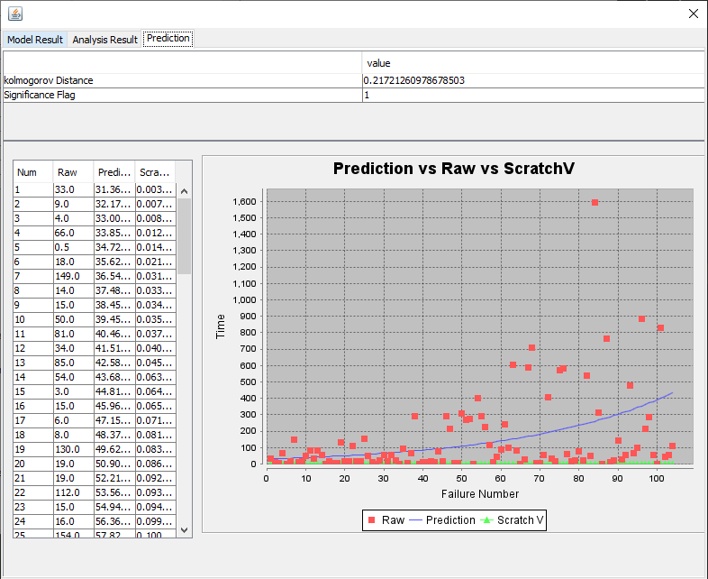
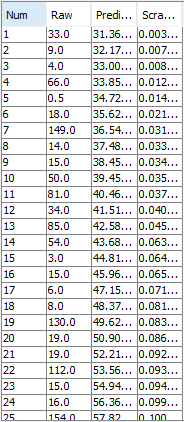
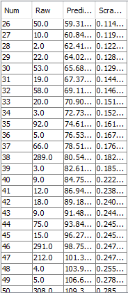
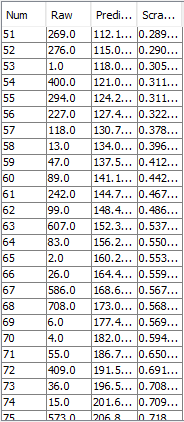
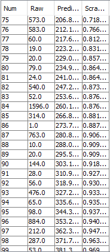
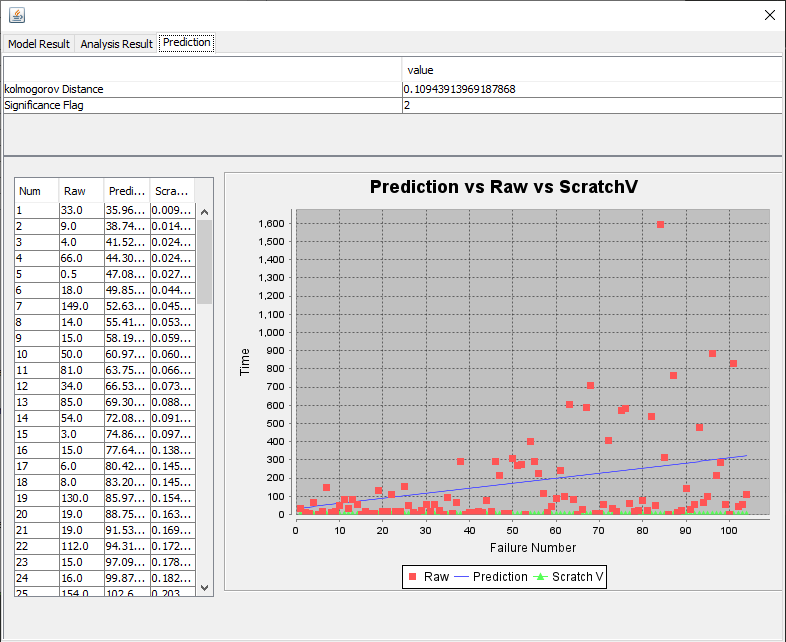
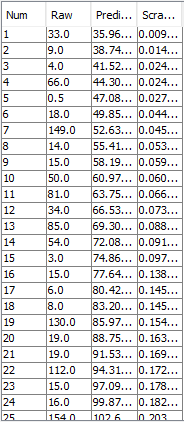
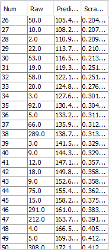
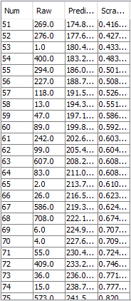
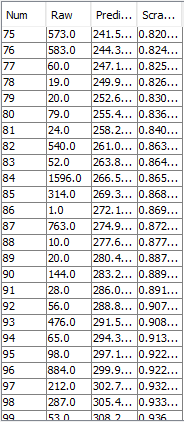

**SENG 438- Software Testing, Reliability, and Quality**

**Lab. Report \#5 – Software Reliability Assessment**

| Group \#:       | 4  |
|-----------------|---|
| Student Names:  |  Uruba Alam |
|                 |  Naina Gupta |
|                 |  Ding Kai Wu |
|                 |  Chuhang Qi |

# Introduction

In this lab, we evaluated the reliability and usage of a system utilizing tools such as SRTAT and the Reliability Demonstration Chart (RDC-11) on Excel. We used two techniques to assess the failure data, including Reliability Growth Testing (RGT) and Reliability Demonstration Chart (RDC). Reliability growth testing shows system reliability through a graph made from data points gathered during testing. RDC take the system parameter and failure rate we want to achieve into account and shows us whether the system is stable to use or not.

# Assessment Using Reliability Growth Testing 

## Result of model comparison

After some trial and errors, we think that CSR3.DAT file inside the Time_Between_Failures folder suits our analysis. It has sufficient amount of data, and the time between failures seems random and distributed enough. We will be using the 'Geometric' and 'Littlewood and Varral's Bayesian Reliability' models, as other models did not function on our devices. During the recorded lecture professor also mentions that these two models have been proven to work while others are still under development.

## Result of range analysis

The data we've chosen has a huge range. From 0.5 to 1596. From the graph we can see that most time between failures are between 0 and 100 seconds. As time goes on failures are happening less frequently (the time between failures are becoming larger). As a result, we see on the graph that the points are more scattered towards the end. This could mean that the system is getting more stable as time goes on, which is a good sign in system reliability. We tried to use CASRE to run the Laplace tests, but since the software is too old, it can't be run on any computer. Ideally we would use Laplace to fund the section of the graph where the reliability growth is below -2. This means we have a stable reliability for our system.

## Plots for failure rate and reliability of the SUT for the test data provided

**Geometric Model - Overall**

**Geometric Model - Detail**

**Littlewood and Varral's Bayesian Reliability Model - Overall**

**Littlewood and Varral's Bayesian Reliability Model - Detail**

## A discussion on decision making given a target failure rate

For Littlewood and Varral's Bayesian Reliability model, we deliberately chose linear function instead of quadratic function to see which model would give us the best prediction. Based on our reliability growth prediction using the Geometric model, the quadratic function seems to be increasing exponentially. Also the growth is very slow, the curve is growing steeper over time. This means that our system is becoming more reliable as time goes on, which fits better with the limited data set we have. Meanwhile the Littlewood and Varral's Bayesian Reliability model produced a linear function which grows at a steady speed.

Based on that, we think the prediction of the Geometric model reflects the system behavior better. As mentioned before, time between failures are slowly increasing, which means whatever solution we applied to the system is working. The rate of new failures occurring should slow down. Then giving a target failure rate, this model would produce a more accurate result.

There are some additional information we can look at. The Littlewood and Varral's Bayesian Reliability model's starting point is a lot higher than the Geometric model. Even at the middle of our data set, it's still predicting higher time between failures. For example, for entry 60 Geometric is predicting 141.4 while Littlewood is predicting 199.8. But at the end Littlewood's prediction is a lot lower than Geometric (308.2 vs 381.3). As mentioned above, we know the system is behaving more towards the Geometric model. Then giving a target failure rate, we would use the Geometric model.

## A discussion on the advantages and disadvantages of reliability growth analysis

The advantage of a reliability growth analysis is that it gives us a quick and easy understanding of the system's reliability over time, and allows us to see a bit into the future. We can predict if the reliability will increase or decrease over time. We can then make decisions based on the graph quickly (i.e. increase system testing or rollback a previous change).

The disadvantage also comes with "predicting the future". We have unlimited amount of parameters for each model. Every system is different, there could be dozens of models that fits a system. It takes a lot of time and resources to go through each model and get the desired result. In the end, it comes down to experience and knowledge to know how the system works, and which model fits the system the best. 

# Assessment Using Reliability Demonstration Chart 
 

**Half MTTF min**
 

 
From this chart, it can be seen that when MTTF min is halved, the SUT is within the rejection (red portion) part of the system

 
 

**MTTF min**
 

 
From this chart, it can be seen that at MTTF min, the SUT is within the continue testing (yellow portion) part of the system

 
 

**Double MTTF min**
 

 
From this chart, it can be seen that when MTTF min is doubled, theSUT is within the accept (green portion) part of the system

 
 

The mean time to Failure (MTTF) min was found through trial and error. We first started by adjusting the data to ensure that the graph axes were correct and then adjusted the data itself for calculating MTTF until we found an ideal value. We derived the MTTF min value which was 0.33 by finding the the point near the acceptance (green portion) threshold of the graph  (this can be seen above in the MMTF min graph above as well). This is due to the fact that MTTF min represents the point at which the system under test becomes acceptable. With normalized failure data represented by the ratio of failure time to MTTF, we crafted graphical representations showcasing Twice MTTFmin and Half MTTFmin. By altering the threshold for the maximum acceptable number of failures, we crafted and illustrated these graphs accordingly. Through consistent trial and error with the RDC chart, we were able to find the MTTF min.

 
 

**Advantages vs. Disadvantages of RDC**

Disadvantages:
* limiting factors and limited information that affects the reliability, such as environmental conditions, usage patterns or variations in manufacturing processes.
* Although the RDC displays the number of failures per unit time, it does not clearly indicate how or why the system failed, which is important when debugging the system.

Advantages:
* The visualizations of the data in the RDC charts, the rejected, continued and accepted regions make it easier to understand if data is actually reliable.
* Color coded
* Overall it is easier to make decisions using RDC related to code and its reliability.

# Comparison of Results

# Discussion on Similarity and Differences of the Two Techniques

# How the team work/effort was divided and managed

Our whole group worked on the assignment together. Bill and Chuhang primarily worked on part 1 while Naina and Uruba primarily worked on part 2. This split was to increase our efficiency. After the completion of both parts, we peer reviewed and explained our approaches and results to one another in order to ensure everyone was on the same page and understood the assignment thoroughly. 

# Difficulties encountered, challenges overcome, and lessons learned

The main problem we with the RDC.xls file was the issue of where and how to use the failure data form the DAT files, thus learning it and how to use it was a huge challenge. We encountered the issue of knowing the precise method and location for inputting failure data. It was just a hurdle to learn how to use a new software (especially with unclear instructions) and getting to use to it's functionalities and features.

# Comments/feedback on the lab itself
The instructions were very unclear and vague, so we had to learn ourselves how to use the tools like RDC-11.
